# Assignment 2 - DIP with PyTorch

### 1.Poisson Image Editing with PyTorch.
#### Running
 run :`python run_blending_gradio.py`.
 #### Results
 ##### Result1
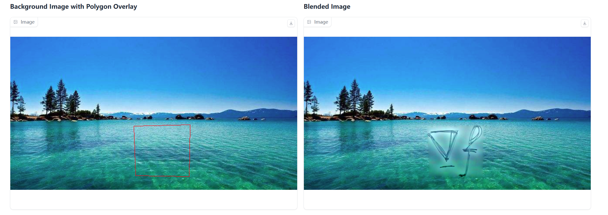 

 ##### Result2
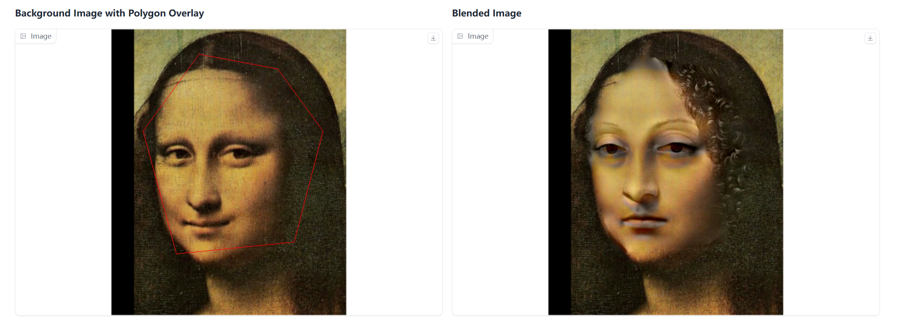 

 ##### Result3
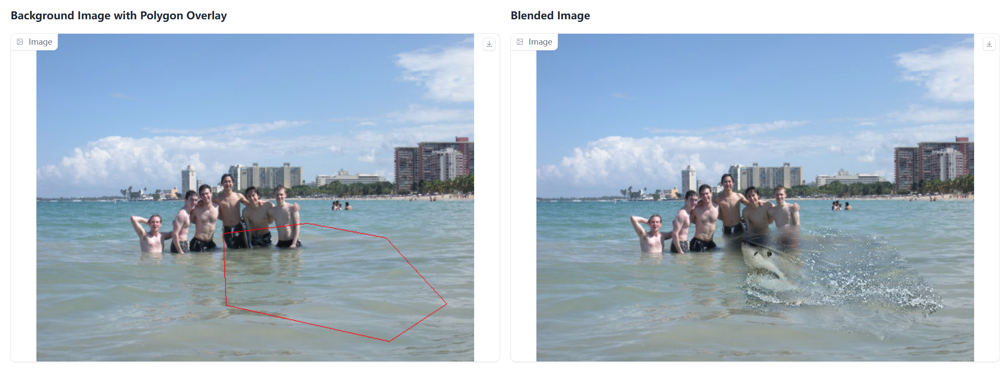 
 ##### Result4(更改梯度矩阵)
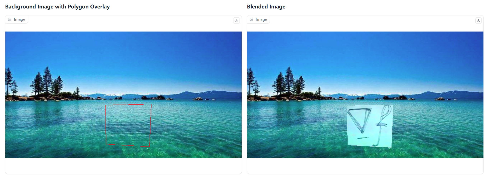 
 ##### Result5(减少迭代次数)
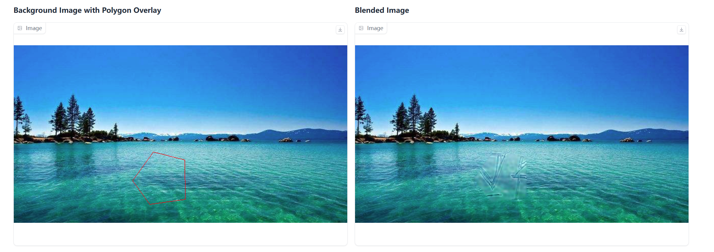 

### 2. Pix2Pix.
#### Get Data Ready
放入数据集及list文件，设置对应的路径.
#### Running
run : `python train.py`.

#### Results
##### val epoch_100
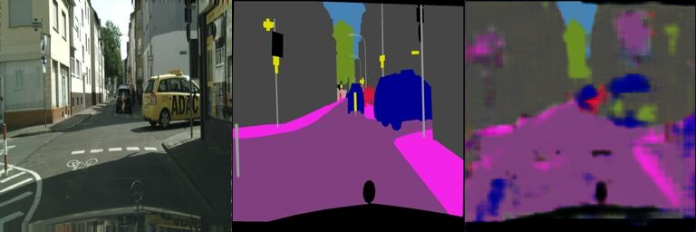 
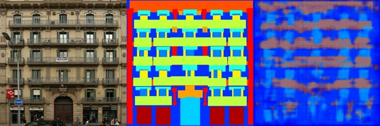 

##### val epoch_400
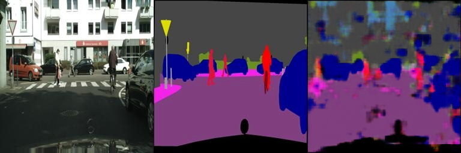 
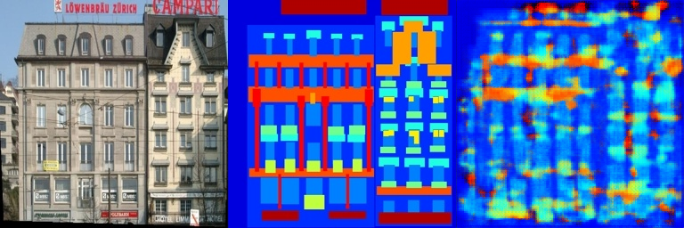 

##### val epoch_795
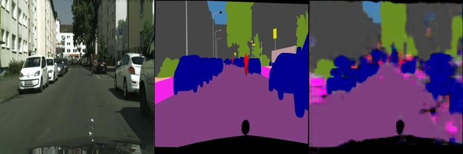 
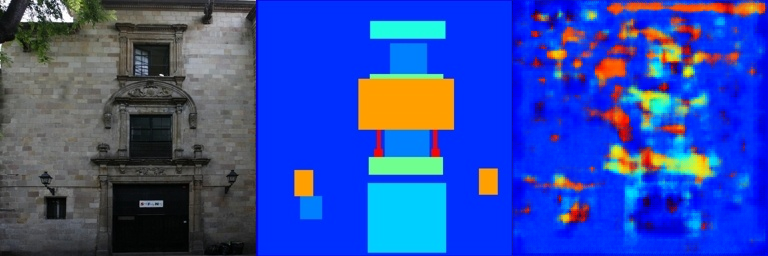 

---
