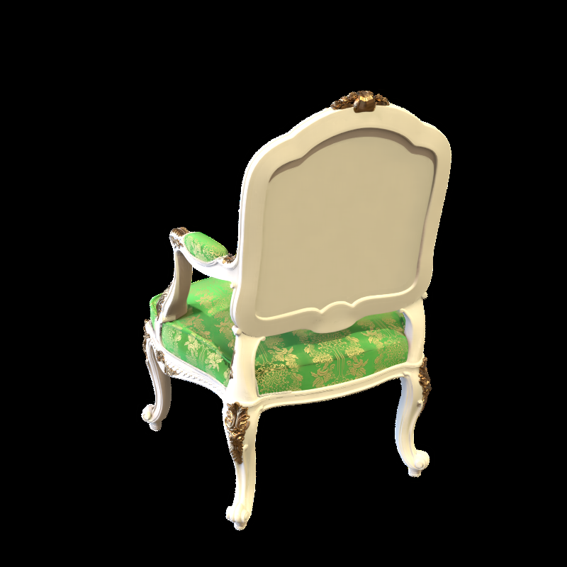
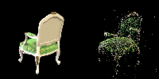
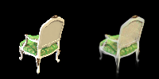
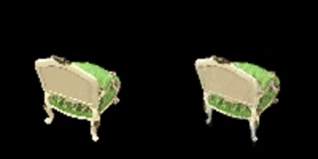

# Assignment 4 - 3DGS

### Train
##### Use the MVS to generate the 3D point cloud
run:`python mvs_with_colmap.py --data_dir data/chair`;

#### Debug the reconstruction
run:`python debug_mvs_by_projecting_pts.py --data_dir data/chair`;

#### Build 3DGS model
run:`python train.py --colmap_dir data/chair --checkpoint_dir data/chair/checkpoints`.

### Results

#### original picture:r89

#### projection(point cloud)

#### result of train

