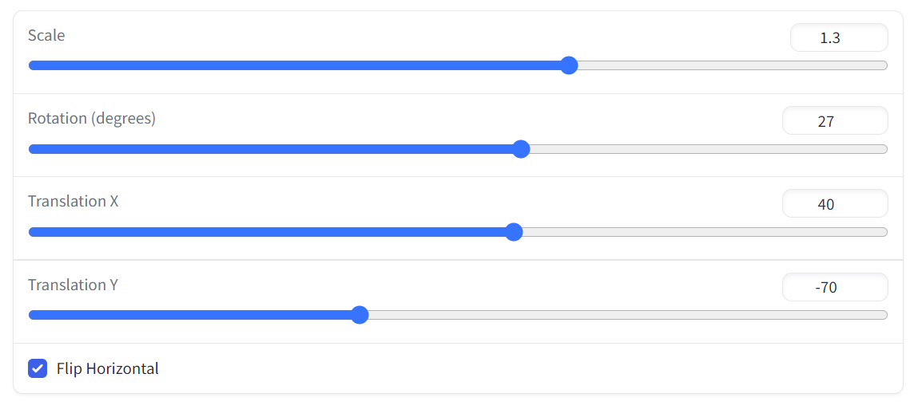
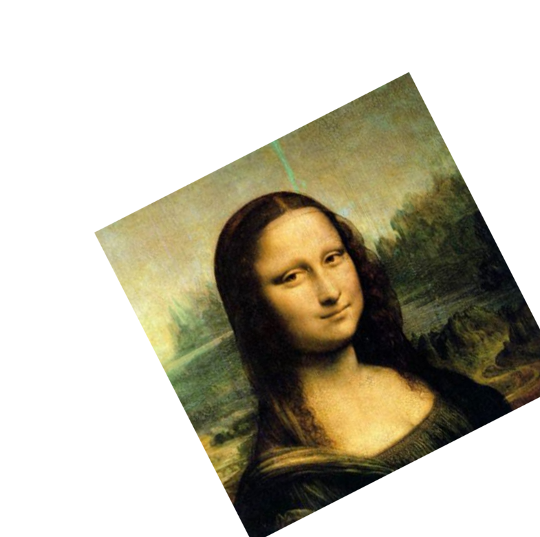

# Assignment 1 - Image Warping

## Implementation of Image Geometric Transformation

This repository is Xiande Huang's implementation of Assignment_01 of DIP. 


## Requirements

To install requirements:

```setup
python -m pip install -r requirements.txt
不知是本人代码还是py版本的问题，使用最新版numpy会报bool8的错误，因此本人运行时使用的版本为numpy==1.23.2
```


## Running

To run basic transformation, run:

```basic
python run_global_transform.py
```

To run point guided transformation, run:

```point
python run_point_transform.py
```

## Results (need add more result images)
### Basic Transformation



### Point Guided Deformation:


## Acknowledgement

>📋 Thanks for the algorithms proposed by [Image Deformation Using Moving Least Squares](https://people.engr.tamu.edu/schaefer/research/mls.pdf).
