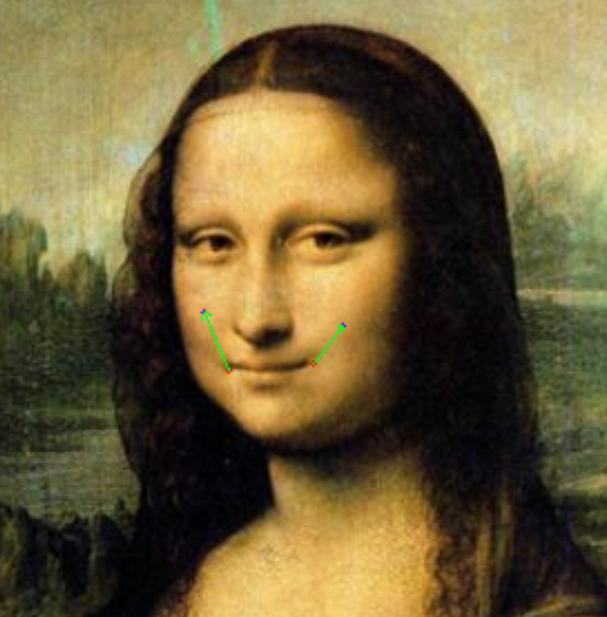
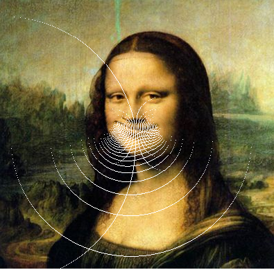
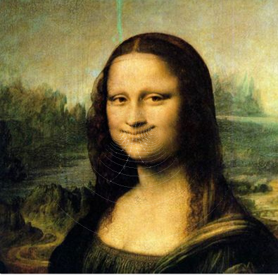

# Assignment 1 - Image Warping

## Implementation of Image Geometric Transformation

This repository is Xiande Huang's implementation of Assignment_01 of DIP. 


## Requirements

To install requirements:

```setup
python -m pip install -r requirements.txt
```
不知是本人代码还是py版本的问题，使用最新版numpy会报bool8的错误，因此本人运行时使用的版本为numpy==1.23.2


## Running

To run basic transformation, run:

```basic
python run_global_transform.py
```

To run point guided transformation, run:

```point
python run_point_transform.py
```

## Results
### Basic Transformation

#### option


#### result


### Point Guided Deformation:

#### 标记图


#### 初步结果
由于处理图像使用的映射在图片坐标范围内不是一个满射，因此结果图会出现一些白纹



#### 改进结果
重新检测结果图的像素值，若为白色，则用周围8个点的平均像素进行填补，可以填补部分白纹，但对于原本就应是白色的点会造成些许偏差



## Acknowledgement

>📋 Thanks for the algorithms proposed by [Image Warping by Radial Basis Functions](https://onlinelibrary.wiley.com/doi/pdf/10.1111%2F1467-8659.1410035).
